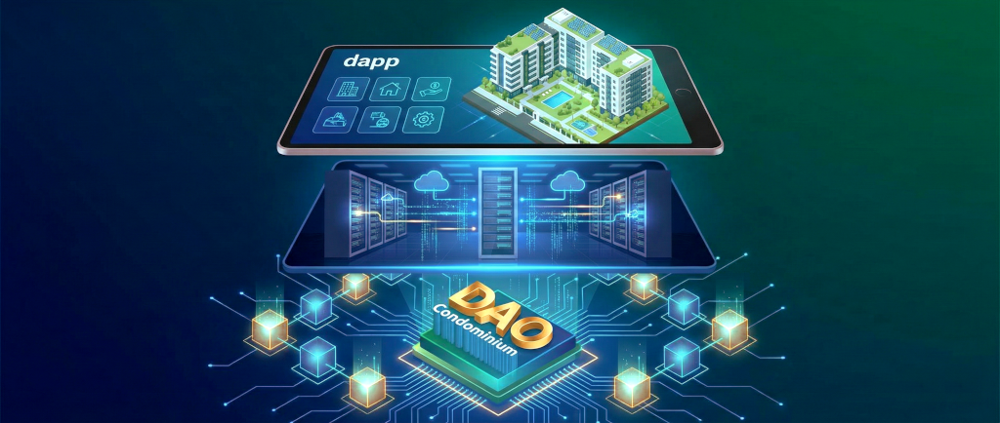

# DAO CONDOMINIUM

**[🇧🇷 Leia em Português](README-PT.md)**



> **⚠️ ARCHIVED REPOSITORY**  
> This repository has been archived and is no longer actively maintained. It serves as a reference implementation for educational purposes.

A complete Web3 solution for condominium management through smart contracts, featuring a decentralized autonomous organization (DAO) structure.

## :speech_balloon: Description

This project is a comprehensive blockchain-based condominium management system that demonstrates the integration of three distinct layers: smart contracts (blockchain), backend API, and a decentralized application (DApp). The system enables transparent and democratic management of condominium operations through voting mechanisms, quota payments, and resident management.

## Table of Contents

- [Features](#features)
- [Architecture](#architecture)
  - [Blockchain Layer](#blockchain-layer)
  - [Backend Layer](#backend-layer)
  - [DApp Layer](#dapp-layer)
- [Built With](#built-with)
- [Getting Started](#getting-started)
  - [Prerequisites](#prerequisites)
  - [Installation](#installation)
  - [Configuration](#configuration)
  - [Usage](#usage)
- [Deployed Contracts](#deployed-contracts)
- [Back Matter](#back-matter)
  - [Acknowledgements](#acknowledgements)
  - [See Also](#see-also)
  - [Contributing](#contributing)
  - [Authors & Contributors](#authors--contributors)
  - [Legal Disclaimer](#legal-disclaimer)
  - [License](#license)

## Features

### Smart Contract Features
- **Resident Management**: Add, remove, and manage condominium residents
- **Voting System**: Democratic decision-making through proposals and voting
- **Quota Management**: Track and process monthly quota payments
- **Topic Discussion**: Create and manage discussion topics with file attachments
- **Access Control**: Role-based permissions (Manager, Counselor, Resident)

### Backend Features
- **RESTful API**: Complete API for frontend integration
- **Web3 Integration**: Direct interaction with blockchain via Ethers.js v6
- **Authentication**: JWT-based authentication with Web3 wallet signature
- **File Management**: Upload and storage of topic-related documents
- **MongoDB Integration**: Off-chain data persistence

### DApp Features
- **Web3 Login**: MetaMask wallet integration
- **Resident Dashboard**: View and manage resident information
- **Voting Interface**: Participate in condominium decisions
- **Quota Payment**: Pay monthly quotas through the interface
- **Topic Management**: Create, view, and interact with discussion topics
- **Settings**: Configure condominium parameters

## Architecture

This project follows a three-layer architecture:

```
┌─────────────────────────────────────────────────────┐
│                    DApp (Frontend)                  │
│              React + TypeScript + Web3              │
└─────────────────────────────────────────────────────┘
                         ↕
┌─────────────────────────────────────────────────────┐
│                  Backend (API)                      │
│           Express + MongoDB + Ethers.js             │
└─────────────────────────────────────────────────────┘
                         ↕
┌─────────────────────────────────────────────────────┐
│              Blockchain (Smart Contracts)           │
│              Hardhat + Solidity + BSC               │
└─────────────────────────────────────────────────────┘
```

### Blockchain Layer

Located in `/blockchain` directory.

**Smart Contracts:**
- `Condominium.sol` - Main DAO contract with core logic
- `CondominiumAdapter.sol` - Upgradeable proxy adapter
- `CondominiumLib.sol` - Shared library functions
- `ICondominium.sol` - Contract interface

**Key Technologies:**
- Hardhat 2.14.1
- Solidity
- Hardhat Toolbox
- Solidity Coverage

**Available Scripts:**
```bash
npm test      # Run tests with coverage
npm run deploy    # Deploy to BSC Testnet
npm run verify    # Verify contracts on BSCscan
```

### Backend Layer

Located in `/backend` directory.

**Architecture:**
```
Request → Router → Middleware → Controller → Repository → Model
Response ← Router ← Middleware ← Controller ← Repository ← Model
```

**Key Technologies:**
- Node.js + Express
- TypeScript 5.1.6
- Ethers.js 6.0.2
- MongoDB 5.7.0
- JWT Authentication
- Multer (file uploads)

**Available Scripts:**
```bash
npm run dev       # Development with nodemon
npm run compile   # Compile TypeScript
npm start         # Production server
```

### DApp Layer

Located in `/dapp` directory.

**Key Technologies:**
- React 18.2.0
- TypeScript 4.9.5
- React Router DOM 6.14.1
- Ethers.js 6.0.2
- Material Dashboard (UI Framework)
- Axios 1.4.0

**Main Pages:**
- `/login` - Wallet authentication
- `/residents` - Resident management
- `/topics` - Discussion topics and voting
- `/quota` - Quota payment interface
- `/settings` - System configuration

**Available Scripts:**
```bash
npm start     # Development server
npm run build # Production build
npm test      # Run tests
```

## Built With

### Blockchain
- [Hardhat](https://hardhat.org/) - Ethereum development environment
- [Solidity](https://soliditylang.org/) - Smart contract language
- [Ethers.js](https://ethers.org/) - Web3 library

### Backend
- [Node.js](https://nodejs.org/) - JavaScript runtime
- [Express](https://expressjs.com/) - Web framework
- [MongoDB](https://www.mongodb.com/) - NoSQL database
- [TypeScript](https://www.typescriptlang.org/) - Typed JavaScript
- [JWT](https://jwt.io/) - Authentication tokens

### Frontend
- [React](https://react.dev/) - UI library
- [TypeScript](https://www.typescriptlang.org/) - Typed JavaScript
- [Material Dashboard](https://www.creative-tim.com/) - UI framework
- [Axios](https://axios-http.com/) - HTTP client

## Getting Started

### Prerequisites

- Node.js ^16.8.0
- MongoDB (running instance)
- MetaMask wallet
- BSC Testnet BNB (for testing)

### Installation

Clone the repository:

```bash
git clone https://github.com/mabesi/dao-condominium.git
cd dao-condominium
```

Install dependencies for each layer:

```bash
# Blockchain
cd blockchain
npm install

# Backend
cd ../backend
npm install

# DApp
cd ../dapp
npm install
```

### Configuration

#### 1. Blockchain Configuration

Create `.env` file in `/blockchain`:

```bash
PRIVATE_KEY=your_wallet_private_key
BSCSCAN_API_KEY=your_bscscan_api_key
```

#### 2. Backend Configuration

Create `.env` file in `/backend`:

```bash
PORT=3001
CORS_ORIGIN=http://localhost:3000
MONGO_HOST=mongodb://localhost:27017
MONGO_DATABASE=dao_condominium
JWT_SECRET=your_jwt_secret
JWT_EXPIRES=1h
CONTRACT_ADDRESS=deployed_contract_address
BLOCKCHAIN_URL=https://data-seed-prebsc-1-s1.binance.org:8545/
```

#### 3. DApp Configuration

Create `.env` file in `/dapp`:

```bash
REACT_APP_API_URL=http://localhost:3001
REACT_APP_CONTRACT_ADDRESS=deployed_contract_address
REACT_APP_CHAIN_ID=97
```

### Usage

#### 1. Deploy Smart Contracts

```bash
cd blockchain
npm run compile
npm run deploy
# Copy the deployed contract address
```

#### 2. Start Backend Server

```bash
cd backend
npm run dev
# Server runs on http://localhost:3001
```

#### 3. Start DApp

```bash
cd dapp
npm start
# DApp runs on http://localhost:3000
```

#### 4. Access the Application

1. Open http://localhost:3000 in your browser
2. Connect your MetaMask wallet (BSC Testnet)
3. Sign the authentication message
4. Start managing your condominium!

## Deployed Contracts

**BSC Testnet (July 20, 2023):**

- Condominium Lib: `0xd82cd289E5da7A3426F775c722ea3fC639B401C7`
- Condominium: `0xfFbfE2E95Ded161E0b61C710642c613e3303AF3E`
- Condominium Adapter: `0xeb2A957219F561Bac4D898EA448dF397628789FB`

## Back Matter

### Acknowledgements

Thanks to all these amazing people and tools that served as a source of knowledge or were an integral part in the construction of this project.

- [Hardhat](https://hardhat.org/) - Ethereum Development Environment
- [Solidity](https://soliditylang.org/) - Smart Contract Language
- [Ethers.js](https://ethers.org/) - Web3 Library
- [Node.js](https://nodejs.org/) - JavaScript Runtime
- [Express](https://expressjs.com/) - Web Framework
- [React](https://react.dev/) - UI Library
- [MongoDB](https://www.mongodb.com/) - NoSQL Database
- [TypeScript](https://www.typescriptlang.org/) - Typed Programming Language
- [Material Dashboard](https://www.creative-tim.com/) - UI Framework
- [LuizTools](https://www.luiztools.com.br/) - Web3 and Blockchain Courses

### See Also

Explore these related projects for learning and reference:

- [Basic Token ERC-20](https://github.com/mabesi/solidity-coin-erc20)
- [Basic Token BEP-20](https://github.com/mabesi/solidity-coin-bep20)
- [Basic NFT ERC-721](https://github.com/mabesi/solidity-nft-erc721)
- [Basic Azuki NFT ERC-721A](https://github.com/mabesi/azuki-nft)
- [Basic Multi Token ERC-1155](https://github.com/mabesi/solidity-multitoken-erc1155)

### Contributing

Please first ask us for the details of code of conduct. After this follow these steps of the process for submitting pull requests to us.

1. Fork it!
2. Create your feature branch: `git checkout -b my-new-feature`
3. Add your changes: `git add .`
4. Commit your changes: `git commit -am 'Add some feature'`
5. Push to the branch: `git push origin my-new-feature`
6. Submit a pull request :sunglasses:

### Authors & Contributors

| [<br><sub>Plinio Mabesi</sub>](https://github.com/mabesi) |
| :---: |

### Legal Disclaimer

<p align="justify">The use of this tool, for any purpose, will occur at your own risk, being your sole responsibility for any legal implications arising from it.</p>
<p align="justify">It is also the end user's responsibility to know and obey all applicable local, state and federal laws. Developers take no responsibility and are not liable for any misuse or damage caused by this program.</p>

### License

This project is licensed under the MIT License.